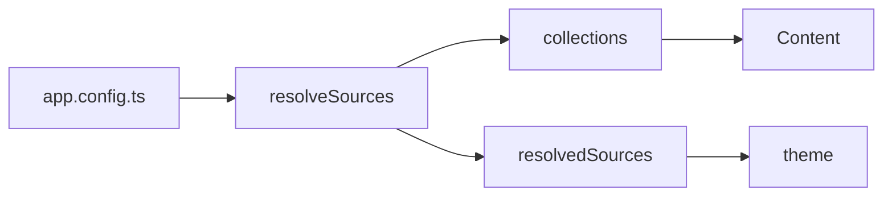

Anything in `app/components/content/` is callable from Markdown with MDC syntax —
no module, no MDX. These ship with the layer; your own file of the same name
replaces one.

Every block below is shown twice: once as this page renders it, once as the
Markdown that produced it.

## Callout

::callout{type="tip" title="Nothing else is required"}
The body is Markdown too — links, `code` and lists all work inside one.
::

```md
::callout{type="tip" title="Nothing else is required"}
The body is Markdown too — links, `code` and lists all work inside one.
::
```

| Prop    | Type                                     | Default  |
| :------ | :--------------------------------------- | :------- |
| `type`  | `info` · `tip` · `warning` · `danger`    | `info`   |
| `title` | `string`                                 | —        |
| `icon`  | `string`                                 | per type |

## Steps

Wraps an **ordered list** in a stepped layout. No props — it numbers whatever
list it wraps.

::steps
1. Add the dependency.
2. Extend the layer.
3. Write Markdown.
::

```md
::steps
1. Add the dependency.
2. Extend the layer.
3. Write Markdown.
::
```

Worth reaching for as soon as a step carries a code block: in a plain ordered
list the fence pushes the text away from its own number, and this layout keeps
the number pinned beside it.

## Code group

Several fenced blocks as one tabbed block. Each tab's label is the fence's own
filename, because that is what the reader is choosing between and it is already
written.

::code-group
```ts [nuxt.config.ts]
export default defineNuxtConfig({
  extends: ['@kirchdev/duxt']
});
```

```json [package.json]
{
  "devDependencies": {
    "@kirchdev/duxt": "latest"
  }
}
```
::

````md
::code-group
```ts [nuxt.config.ts]
export default defineNuxtConfig({
  extends: ['@kirchdev/duxt']
});
```

```json [package.json]
{
  "devDependencies": {
    "@kirchdev/duxt": "latest"
  }
}
```
::
````

## Tabs

`::tab-group` around `::tab` blocks, for anything that is not code. A nested
block needs one more colon than its parent.

:::tab-group
  ::tab{label="macOS"}
  Everything the layer needs ships with Node.
  ::

  ::tab{label="Windows"}
  The same, and nothing about the build is platform-specific.
  ::
:::

```md
:::tab-group
  ::tab{label="macOS"}
  Everything the layer needs ships with Node.
  ::

  ::tab{label="Windows"}
  The same, and nothing about the build is platform-specific.
  ::
:::
```

## Accordion

`::accordion` around `::accordion-item{label icon}`.

:::accordion
  ::accordion-item{label="Does a consumer write content.config.ts?" icon="lucide:file-question"}
  No. `duxt.sources` in `app.config.ts` is the only declaration; the layer's own
  `content.config.ts` reads it.
  ::

  ::accordion-item{label="Is a native SQLite driver needed?" icon="lucide:database"}
  No. The database is read through `node:sqlite`, which is why the build needs
  Node 24.
  ::
:::

```md
:::accordion
  ::accordion-item{label="Does a consumer write content.config.ts?" icon="lucide:file-question"}
  No. `duxt.sources` in `app.config.ts` is the only declaration.
  ::
:::
```

## Fields

For API parameters, where each one carries more explanation than a table row
holds. A table stays the better choice for a long list of one-line fields — see
[Sources](/reference/sources), where eight fields are meant to be compared at a
glance rather than read one by one.

:::field-group
  ::field{name="path" type="string" required}
  Folder holding the Markdown, relative to the repository root.
  ::

  ::field{name="history" type="boolean" default="false"}
  Read this source's git history for "Last updated" and the contributors.
  Unshallows a remote clone once, which downloads the whole history.
  ::
:::

```md
:::field-group
  ::field{name="path" type="string" required}
  Folder holding the Markdown, relative to the repository root.
  ::
:::
```

| Prop       | Type      | Notes                              |
| :--------- | :-------- | :--------------------------------- |
| `name`     | `string`  | The parameter's name               |
| `type`     | `string`  | Drawn beside it, in mono           |
| `default`  | `string`  | Right-aligned, as `= value`        |
| `required` | `boolean` | Draws a badge instead of a default |

A definition list would be the semantic choice and is the wrong one: the name,
the type, the default and whether it is required are four different things, and
`<dt>` gives them one slot between them.

## Package managers

One command, one tab per manager, with the reader's choice remembered across
pages. Write the command without the manager: `npm`'s `install` and each
manager's `dlx` spelling are substituted.

::package-managers{command="add -D @kirchdev/duxt"}
::

```md
::package-managers{command="add -D @kirchdev/duxt"}
::
```

| Prop       | Type       | Default                       |
| :--------- | :--------- | :---------------------------- |
| `command`  | `string`   | required                      |
| `managers` | `string[]` | `duxt.packageManagers`        |

## File tree

::file-tree{title="your-project/"}
---
tree:
  - name: docs/
    children:
      - name: index.md
      - name: 1.getting-started/
        children:
          - name: index.md
          - name: 1.installation.md
  - name: app/
    children:
      - name: app.config.ts
  - name: nuxt.config.ts
---
::

```md
::file-tree{title="your-project/"}
---
tree:
  - name: docs/
    children:
      - name: index.md
  - name: nuxt.config.ts
---
::
```

An entry is `{ name, children? }`; a name ending in `/`, or one with children, is
a directory. Built on Reka UI's tree, so it has roving focus, arrow-key
navigation and the ARIA roles.

## Preview

A component rendered as the page renders it, with the source one tab away. The
example is the real component in the real theme — same tokens, same dark mode —
so a reader sees what a block does rather than a description of it.

::preview
:::callout{type="tip"}
Rendered by the page you are reading.
:::

#code
```mdc
::callout{type="tip"}
Rendered by the page you are reading.
::
```
::

````mdc
::preview
:::callout{type="tip"}
Rendered by the page you are reading.
:::

#code
```mdc
::callout{type="tip"}
Rendered by the page you are reading.
::
```
::
````

The source in `#code` is written out rather than derived from the example above
it, and that is the block's one real cost. By the time the component runs, its
children are rendered nodes and the Markdown that produced them is gone;
re-serialising them would guess at a syntax they never came from. Leave `#code`
out and the example renders on its own, with no tab strip.

::callout{type="warning" title="Two copies drift"}
Nothing checks that the source tab matches what is rendered beside it. Keep the
example short enough that changing one without the other is obvious.
::

## Page cards

The children of a section, as cards. Used on a section's `index.md`; with no
prop it lists the children of the current page — which is why it is shown here
by name rather than rendered: this page has no children.

| Prop   | Type     | Default           |
| :----- | :------- | :---------------- |
| `path` | `string` | the current page  |

## Partial

Inline, and the one component that reaches outside the page's own source:
`_partials/` in **any** source feeds one shared collection.

```md
:partial{name="install"}
```

## Since

Inline. Marks the version something arrived in — usable in a heading.

### Retries :since{version="v2.0.0"}

```md
### Retries :since{version="v2.0.0"}
```

## Mermaid

A ```` ```mermaid ```` fence is a diagram; `::mermaid` with a `code` prop is the
same component.



Rendered in the browser on demand — the library is half a megabyte, and
fifty-seven pages without a diagram must not pay for the three that have one.
Without JavaScript the source text is shown, which is the honest fallback.

## Prose overrides

`ProseA`, `ProseH2`, `ProseH3`, `ProseH4`, `ProseImg`, `ProsePre` and `ProseTable`
replace what Content renders for plain Markdown, so they are never called by
name. What they add:

| Component                | Adds                                                              |
| :----------------------- | :---------------------------------------------------------------- |
| `ProseA`                 | Resolves a documentation path under the page's own source prefix and locale |
| `ProseH2` … `ProseH4`    | A permalink anchor                                                 |
| `ProseImg`               | A `dark` variant, and click-to-zoom (`zoom="false"` turns it off)   |
| `ProsePre`               | The code block — filename, language icon, copy button, mermaid      |
| `ProseTable`             | Horizontal scrolling instead of a page that scrolls sideways        |

Two Shiki annotations work on the fence itself beyond the four Content ships:
```` ```ts {2,4-6} ```` highlights lines and ```` ```ts /useDuxtConfig/ ````
highlights a word.
