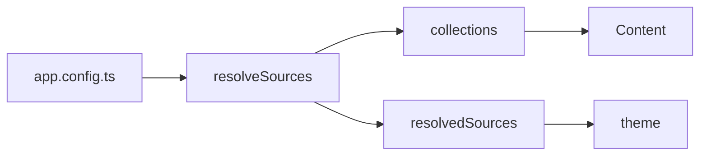

A ```` ```mermaid ```` fence is a diagram; `::mermaid` with a `code` prop is the
same component.

## Usage



`````md

`````

## API

### Props

| Prop   | Type     | Default | Notes                                    |
| :----- | :------- | :------ | :--------------------------------------- |
| `code` | `string` | —       | The diagram source, when not using a fence |

## Notes

Loaded on demand and only in the browser: mermaid is roughly half a megabyte and
pulls in its own parser, and a site where three pages in sixty carry a diagram
must not make the other fifty-seven pay for it.

That also means the diagram is client-rendered — the server output is the source
text, which is the honest fallback for a reader without JavaScript.
