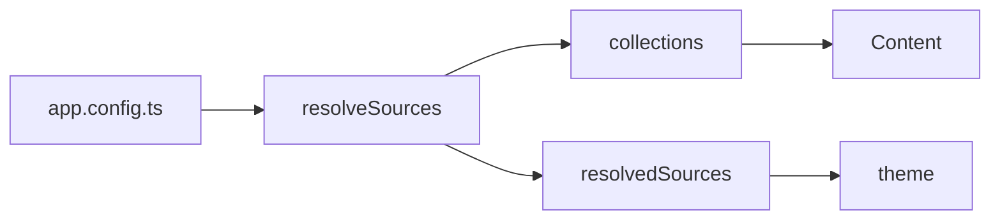
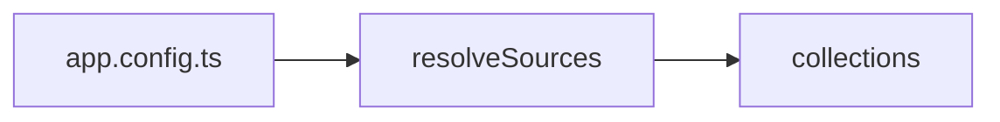

Ein Fence mit ```` ```mermaid ```` ist ein Diagramm; `::mermaid` mit einem
`code`-Prop ist dieselbe Komponente.

## Verwendung



`````md

`````

## API

### Props

| Prop   | Typ      | Standard | Anmerkungen                                 |
| :----- | :------- | :------- | :------------------------------------------ |
| `code` | `string` | —        | Der Quelltext, wenn kein Fence genutzt wird |

## Anmerkungen

Wird bei Bedarf geladen und nur im Browser: mermaid ist rund ein halbes Megabyte
groß und bringt seinen eigenen Parser mit, und eine Website, auf der drei von
sechzig Seiten ein Diagramm tragen, darf die anderen siebenundfünfzig nicht
dafür zahlen lassen.

Das heißt auch, dass das Diagramm im Client gerendert wird — die Server-Ausgabe
ist der Quelltext, und das ist der ehrliche Rückfall für einen Leser ohne
JavaScript.
