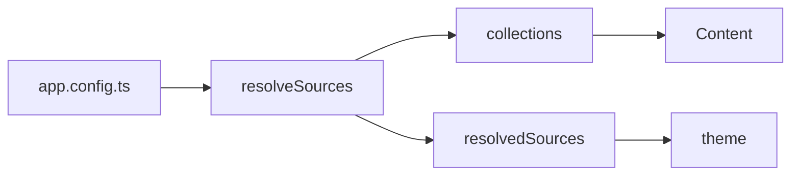

Un bloque ```` ```mermaid ```` es un diagrama; `::mermaid` con una prop `code`
es el mismo componente.

## Uso



`````md

`````

## API

### Props

| Prop   | Tipo     | Por defecto | Notas                                                     |
| :----- | :------- | :---------- | :-------------------------------------------------------- |
| `code` | `string` | —           | El código fuente del diagrama, cuando no se usa un bloque  |

## Notas

Se carga bajo demanda y solo en el navegador: mermaid pesa aproximadamente medio
megabyte y arrastra su propio parser, y un sitio en el que tres páginas de
sesenta llevan un diagrama no debe hacer que las otras cincuenta y siete lo
paguen.

Eso también significa que el diagrama se renderiza en el cliente — la salida del
servidor es el texto fuente, que es el recurso honesto para un lector sin
JavaScript.
