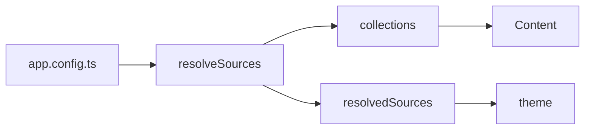

Un bloc ```` ```mermaid ```` est un diagramme ; `::mermaid` avec une prop `code`
est le même composant.

## Utilisation



`````md

`````

## API

### Props

| Prop   | Type     | Par défaut | Remarques                                            |
| :----- | :------- | :--------- | :--------------------------------------------------- |
| `code` | `string` | —          | Le code du diagramme, quand on n’utilise pas de bloc |

## Remarques

Chargé à la demande et seulement dans le navigateur : mermaid pèse environ un
demi-mégaoctet et embarque son propre analyseur, et un site où trois pages sur
soixante portent un diagramme ne doit pas faire payer les cinquante-sept autres.

Cela veut dire aussi que le diagramme est rendu côté client — la sortie du
serveur est le texte source, et c’est le repli honnête pour un lecteur sans
JavaScript.
