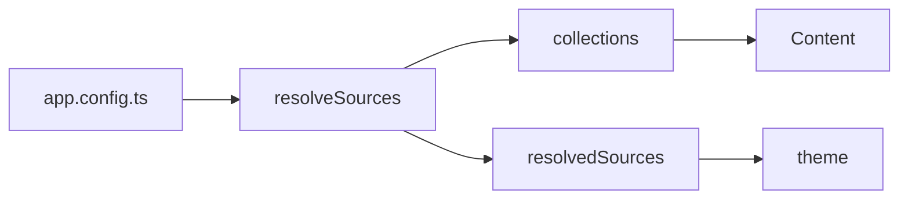

Um bloco ```` ```mermaid ```` é um diagrama; `::mermaid` com uma prop `code` é o
mesmo componente.

## Utilização



`````md

`````

## API

### Props

| Prop   | Tipo     | Por omissão | Notas                                       |
| :----- | :------- | :---------- | :------------------------------------------ |
| `code` | `string` | —           | O código do diagrama, quando não há um bloco |

## Notas

Carregado a pedido e só no navegador: o mermaid tem perto de meio megabyte e
traz consigo o seu próprio parser, e um site onde três páginas em sessenta
transportam um diagrama não pode obrigar as outras cinquenta e sete a pagar por
isso.

Isso também significa que o diagrama é apresentado no cliente — o resultado do
servidor é o texto de origem, que é o recurso honesto para um leitor sem
JavaScript.
